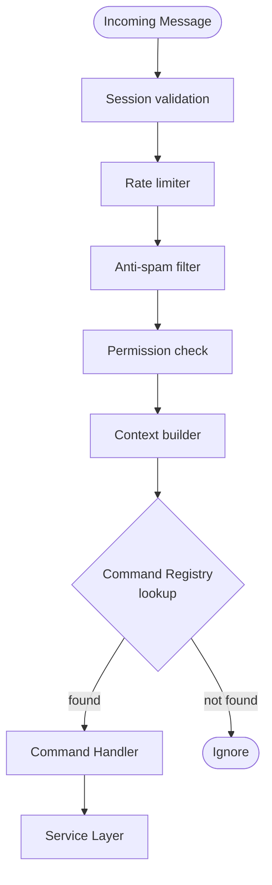
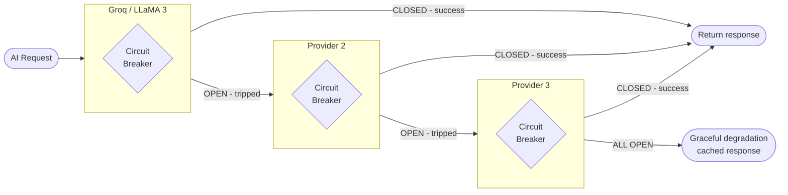
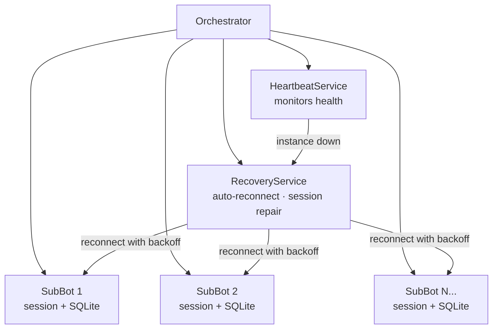
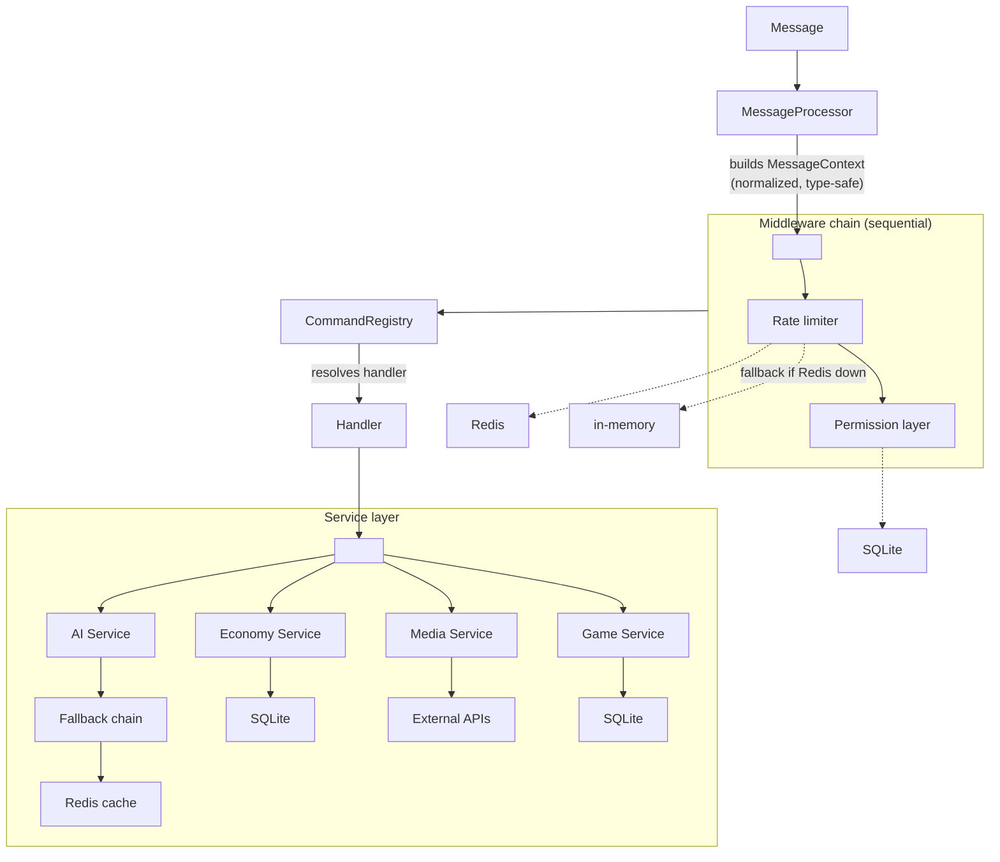

# VaniaBot

A production-grade WhatsApp automation system built with TypeScript — featuring 200+ commands, 80+ integrated services, and a resilient multi-instance architecture designed to stay online under real-world failure conditions.

[](https://www.typescriptlang.org/)
[](https://nodejs.org/)
[](LICENSE)

---

## Why this project exists (and what makes it interesting)

Most WhatsApp bots are a `switch/case` on a message string. VaniaBot started the same way — and became unmaintainable at around 20 commands. This project is the result of rethinking the entire architecture to be modular, resilient, and scalable without rewriting core logic every time something breaks or a new feature is added.

The interesting engineering problems I solved here:

- **How do you manage 50 concurrent WhatsApp sessions** without memory leaks or session corruption?
- **What happens when your AI provider goes down** mid-conversation? How do you fail gracefully without the user noticing?
- **How do you build a command system** where adding a new command never touches existing logic?

The sections below explain each of these in detail.

---

## Architecture

### Core Design: Middleware Pipeline + Command Registry

Instead of a monolithic message handler, every incoming message passes through a sequential middleware chain before reaching a command. This keeps cross-cutting concerns (auth, rate limiting, logging, anti-spam) completely decoupled from business logic.



**The key benefit:** adding a new command means creating one file. Nothing else changes. The registry discovers and registers it automatically at startup.

---

### Resilience: AI Fallback Chain

VaniaBot uses Groq (LLaMA 3) as its primary AI provider. The problem: external APIs fail. Instead of surfacing errors to users, I implemented a fallback chain with Circuit Breaker per provider.



Each Circuit Breaker tracks failure rate over a time window. After a threshold, it opens and stops sending requests to that provider — protecting against cascading failures and rate limit exhaustion. It probes half-open periodically to recover automatically.

**Retry logic:** each attempt uses exponential backoff with jitter to avoid thundering herd when a provider recovers.

---

### Multi-Instance: SubBot Orchestrator

The SubBot system allows running up to 50 parallel WhatsApp sessions from a single process, each with its own isolated state, session, and lifecycle.



Each SubBot instance is independently recoverable. When `HeartbeatService` detects a dead instance, `RecoveryService` attempts reconnection with backoff before escalating to a full session reset. This keeps uptime high without manual intervention.

**Session persistence:** encrypted SQLite per instance, with MongoDB as an optional backup layer.

---

### Data Flow


---

## Tech Stack

| Layer | Technology | Why |
|---|---|---|
| Language | TypeScript 5 | Type safety across 60+ services |
| Runtime | Node.js 20+ | |
| WhatsApp | Baileys v7 | Low-level WA Web protocol |
| AI | Groq SDK (LLaMA 3, Whisper) | Primary provider in fallback chain |
| Primary DB | SQLite | Zero-config, per-instance isolation |
| DB Backup | MongoDB | Optional redundancy layer |
| Cache | Redis / in-memory fallback | Rate limiting, AI response cache |
| Queue | Bull | Background job processing |
| Logging | Pino | Structured, low-overhead logging |
| Validation | Zod | Runtime schema validation |
| Testing | Vitest | Unit + end-to-end |
| Containers | Docker + Compose | Multi-stage builds |

---

## Project Structure

```
VaniaBot/
├── src/
│   ├── commands/           # One file per command, auto-registered
│   │   ├── admin/
│   │   ├── economy/
│   │   ├── fun/
│   │   ├── game/
│   │   ├── media/
│   │   └── utility/
│   │
│   ├── core/               # Client bootstrap + CommandRegistry
│   ├── middlewares/        # Auth, rate limit, anti-spam, context
│   ├── services/
│   │   ├── ai/             # Fallback chain + Circuit Breaker
│   │   ├── database/       # SQLite + MongoDB adapters
│   │   ├── cache/          # Redis + in-memory fallback
│   │   └── external/       # Third-party API wrappers
│   │
│   ├── orchestrator/       # SubBot lifecycle management
│   │   ├── Orchestrator.ts
│   │   ├── HeartbeatService.ts
│   │   └── RecoveryService.ts
│   │
│   ├── workers/            # Bull queue workers
│   ├── repositories/       # Data access layer
│   ├── types/              # Shared TypeScript types
│   └── utils/
│
├── vania.ts                # Bootstrapper
├── index.ts                # Entry point
├── docker-compose.yml
└── package.json
```

---

## Getting Started

### Requirements

- Node.js 20+
- A WhatsApp account for the bot
- A [Groq API key](https://console.groq.com/keys) (free tier available)

### Quick start (script)

```bash
curl -fsSL https://gist.githubusercontent.com/CARLOSGRCIAGRCIA/f94438ffa4dbdca2011771238def3532/raw/VaniaBot.sh | bash -s <version>
```

Installs Node.js, FFmpeg, clones the repo, installs dependencies, and starts the bot with a pairing code. You'll need to create a `.env` file with your credentials (see Configuration below).

### Docker (recommended for production)

```bash
# Create required directories
mkdir -p vaniasession subbots data temp

# Configure environment
cp .env.example .env
nano .env

# Start
docker-compose up -d

# Logs
docker-compose logs -f
```

### Local development

```bash
git clone https://github.com/CARLOSGRCIAGRCIA/VaniaBot.git
cd VaniaBot
npm install
cp .env.example .env
npm run dev    # hot-reload
```

---

## Configuration

### Required

| Variable | Description | Example |
|---|---|---|
| `OWNERS` | Your WhatsApp number (LID format) | `5215512345678@c.us` |
| `GROQ_API_KEY` | Groq API key | `gsk_...` |

### Optional

| Variable | Description | Default |
|---|---|---|
| `BOT_NAME` | Bot display name | `VaniaBot` |
| `BOT_PREFIX` | Command prefix | `.` |
| `DB_TYPE` | `sqlite` or `mongodb` | `sqlite` |
| `MONGODB_URI` | MongoDB connection string | — |
| `USE_REDIS` | Enable Redis cache | `false` |
| `REDIS_URL` | Redis connection string | `redis://localhost:6379` |
| `NODE_ENV` | `development` / `production` | `development` |
| `TZ` | Timezone | `America/Mexico_City` |

---

## Commands overview

VaniaBot has 90+ commands across these domains. Full reference available in the [wiki](../../wiki).

| Domain | Examples |
|---|---|
| AI & Chat | `.ai`, `.transcribe`, `.aiclear` |
| Moderation | `.ban`, `.kick`, `.mute`, `.warn`, `.antispam` |
| Economy | `.daily`, `.work`, `.shop`, `.casino`, `.balance` |
| Games | `.coinflip`, `.slots`, `.quiz` |
| Media | `.sticker`, `.ytmp3`, `.ytmp4`, `.tiktok`, `.instagram` |
| Utilities | `.translate`, `.currency`, `.qr`, `.poll` |
| SubBots | `.subbot create`, `.subbot list`, `.subbot start` |

---

## Troubleshooting

<details>
<summary>Bot doesn't respond to commands</summary>

1. Make sure the bot is an **admin** in the group.
2. Check the prefix in `.env` matches what you're using (default: `.`).
3. Run `.help` to confirm the bot is alive.
</details>

<details>
<summary>"Session not found" error</summary>

Delete the `vaniasession/` folder and restart to re-scan the pairing QR.
</details>

<details>
<summary>Frequent disconnections</summary>

1. Check network stability.
2. In Docker, ensure sufficient CPU/RAM allocation.
3. Enabling Redis improves stability for rate limiting and cache.
</details>

<details>
<summary>Using MongoDB instead of SQLite</summary>

```env
DB_TYPE=mongodb
MONGODB_URI=mongodb://localhost:27017/vaniabot
```
</details>

---

## License

MIT — see [LICENSE](LICENSE) for details.

---

Built by [Carlos Garcia](https://github.com/CARLOSGRCIAGRCIA)