<div align="center">

<picture>
  <source media="(prefers-color-scheme: dark)" srcset="https://readme-typing-svg.demolab.com?font=JetBrains+Mono&weight=700&size=42&pause=1000&color=FF1493&center=true&vCenter=true&width=600&height=80&lines=VaniaBot+IA;WhatsApp+Bot">
  
</picture>

<br/>

```
    ██╗   ██╗ █████╗ ███╗   ██╗██╗ █████╗ ██████╗  ██████╗ ████████╗
    ██║   ██║██╔══██╗████╗  ██║██║██╔══██╗██╔══██╗██╔═══██╗╚══██╔══╝
 ██║   ██║███████║██╔██╗ ██║██║███████║██████╔╝██║   ██║   ██║
 ╚██╗ ██╔╝██╔══██║██║╚██╗██║██║██╔══██║██╔══██╗██║   ██║   ██║
  ╚████╔╝ ██║  ██║██║ ╚████║██║██║  ██║██████╔╝╚██████╔╝   ██║
   ╚═══╝  ╚═╝  ╚═╝╚═╝  ╚═══╝╚═╝╚═╝  ╚═╝╚═════╝  ╚═════╝    ╚═╝
```

<p align="center">
  <strong>Bot multifuncional de WhatsApp construido con TypeScript, Baileys y Groq AI</strong><br/>
  <sub>Moderacion · Economia virtual · Juegos · Descarga de medios · Inteligencia Artificial</sub>
</p>

<br/>

<p align="center">
  
  
  
  
</p>

<p align="center">
  
  
  
  
</p>

<br/>

---

</div>

## Tabla de contenidos

- [Vision general](#-vision-general)
- [Caracteristicas](#-caracteristicas)
- [Arquitectura del sistema](#-arquitectura-del-sistema)
- [Flujo de mensajes](#-flujo-de-mensajes)
- [Requisitos](#-requisitos)
- [Instalacion rapida](#-instalacion-rapida)
- [Configuracion](#-configuracion)
- [Modos de inicio](#-modos-de-inicio)
- [Estructura del proyecto](#-estructura-del-proyecto)
- [Referencia completa de comandos](#-referencia-completa-de-comandos)
- [Sistema de permisos](#-sistema-de-permisos)
- [Motor de economia](#-motor-de-economia)
- [Integracion con IA](#-integracion-con-ia)
- [Sistema de reinicio automatico](#-sistema-de-reinicio-automatico)
- [Pipeline de middleware](#-pipeline-de-middleware)
- [Stack tecnologico](#-stack-tecnologico)
- [Guia de desarrollo](#-guia-de-desarrollo)
- [Aviso legal](#-aviso-legal)

---

## Vision general

VaniaBot IA es un bot de WhatsApp de nivel produccion construido completamente en **TypeScript**. Implementa una arquitectura de **proceso padre-hijo** donde el proceso guardian gestiona el ciclo de vida, la autenticacion y la recuperacion ante fallos, mientras el proceso hijo ejecuta la logica del bot conectado a WhatsApp via Baileys.

El sistema expone mas de **50 comandos** organizados en dominios: moderacion de grupos, economia virtual, juegos con apuesta, descarga de medios desde multiples plataformas, creacion de stickers, inteligencia artificial conversacional y transcripcion de audio. Cada dominio es un servicio aislado coordinado por un `ServiceManager` singleton.

> **Caracteristica central:** VaniaBot no requiere compilacion previa — usa `tsx` para ejecutar TypeScript directamente, lo que acelera el ciclo de desarrollo.

---

## Caracteristicas

<table>
<thead>
<tr>
<th width="33%">Moderacion</th>
<th width="33%">Economia y Juegos</th>
<th width="33%">Inteligencia Artificial</th>
</tr>
</thead>
<tbody>
<tr>
<td>

- Ban / unban con registro permanente
- Kick (puede reingresar)
- Mute con duracion (`10m` `1h` `2d`)
- Warns acumulativos — 3 = kick auto
- Promote y demote de admins
- Autopromocion de owner

</td>
<td>

- Sistema de monedas y balance
- Daily con streak multiplicado
- Weekly con bonus acumulativo
- Trabajo con cooldown de 1 hora
- Tienda de items y cosmeticos
- Tragamonedas y coinflip

</td>
<td>

- Chat multiturno con LLaMA (Groq)
- Historial por usuario y grupo
- Transcripcion de audio (Whisper)
- Limpieza de historial individual o global
- Deteccion automatica de idioma

</td>
</tr>
<tr>
<th>Medios y Stickers</th>
<th>Administracion de grupos</th>
<th>Utilidades</th>
</tr>
<tr>
<td>

- YouTube MP3 y MP4 por URL o busqueda
- TikTok sin marca de agua
- Instagram Reels, posts e imagenes
- Facebook videos y Reels
- Sticker desde imagen o video
- Sticker de texto, meme y cita

</td>
<td>

- Bienvenida personalizada con foto de perfil
- Despedida configurable
- Variables dinamicas en mensajes
- Mencion masiva de todos los miembros
- Logros con 15 categorias desbloqueables
- Sistema de niveles y XP automatico

</td>
<td>

- Calculadora con soporte de expresiones
- Conversor de 7 tipos de unidades
- Acortador de URLs via TinyURL
- Validadores de JID, URL, email y telefono
- Formateo de numeros y tiempos

</td>
</tr>
</tbody>
</table>

---

## Arquitectura del sistema

El proyecto separa responsabilidades entre dos procesos y multiples capas de servicios.

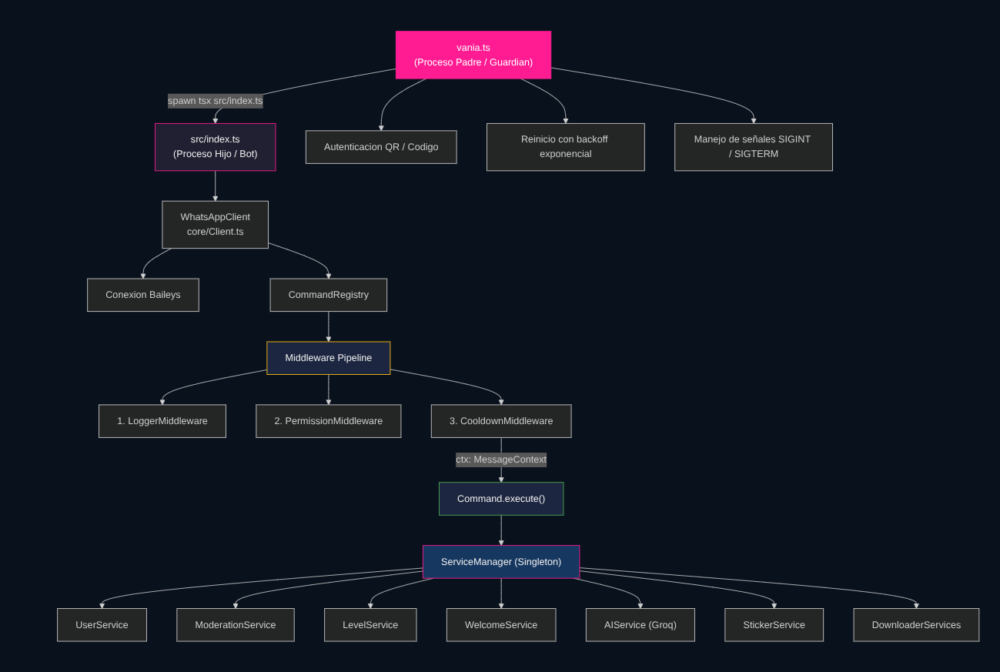

---

## Flujo de mensajes

Cada mensaje entrante de WhatsApp pasa por la siguiente cadena antes de ejecutar un comando.

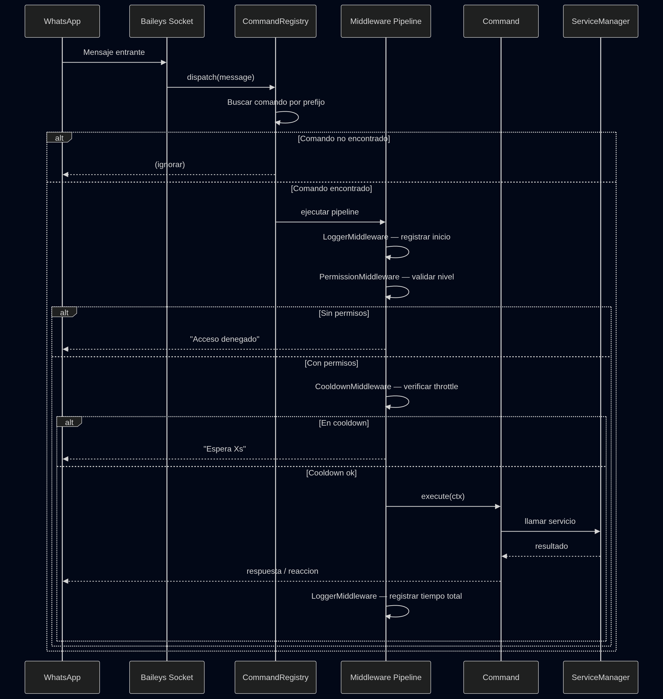

---

## Flujo de autenticacion

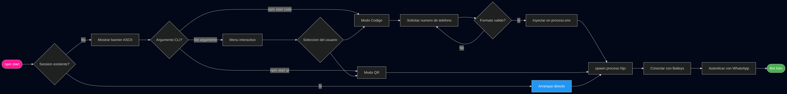

---

## Requisitos

| Herramienta         | Version minima            | Para que se usa                              |
| ------------------- | ------------------------- | -------------------------------------------- |
| **Node.js**         | 18.x o superior           | Runtime principal, ESM nativo                |
| **npm** o **yarn**  | Cualquiera reciente       | Gestion de dependencias                      |
| **FFmpeg**          | Cualquier version estable | Stickers animados, conversion de audio/video |
| **Cuenta WhatsApp** | Activa                    | Numero real o virtual para el bot            |
| **API Key de Groq** | Activa y con cuota        | Chat con LLaMA y transcripcion con Whisper   |

> Obtener API Key de Groq gratis en [console.groq.com](https://console.groq.com)

---

## Instalacion rapida

```bash
# Clonar el repositorio
git clone https://github.com/tu-usuario/vaniabot.git
cd vaniabot

# Instalar dependencias
npm install

# Instalar FFmpeg (Debian / Ubuntu)
sudo apt install ffmpeg

# Instalar FFmpeg (macOS con Homebrew)
brew install ffmpeg

# Configurar variables de entorno
cp .env.example .env
# Editar .env con tu editor preferido

# Iniciar el bot
npm start
```

---

## Configuracion

### Variables de entorno

Crea el archivo `.env` en la raiz del proyecto:

```env
# ════════════════════════════════════════════
#   AUTENTICACION
# ════════════════════════════════════════════

# Numero de telefono del bot con codigo de pais
PHONE_NUMBER=+521XXXXXXXXXX

# Metodo de autenticacion por defecto: qr | code
AUTH_MODE=qr

# ════════════════════════════════════════════
#   INTELIGENCIA ARTIFICIAL
# ════════════════════════════════════════════

# API Key de Groq  https://console.groq.com
GROQ_API_KEY=gsk_xxxxxxxxxxxxxxxxxxxxxxxxxxxx

# ════════════════════════════════════════════
#   OWNER DEL BOT
# ════════════════════════════════════════════

# Numero del propietario principal (con codigo de pais)
OWNER_NUMBER=+521XXXXXXXXXX
```

### Constantes internas

Estas constantes estan definidas directamente en `vania.ts` y pueden modificarse segun sea necesario:

| Constante               | Valor por defecto           | Descripcion                               |
| ----------------------- | --------------------------- | ----------------------------------------- |
| `SESSION_DIR`           | `./vaniasession`            | Directorio de sesion de Baileys           |
| `SESSION_CREDS`         | `./vaniasession/creds.json` | Archivo de credenciales                   |
| `BOOT_FLAG`             | `./.vania-session`          | Flag para evitar re-animacion del banner  |
| `MAX_QUICK_RESTARTS`    | `5`                         | Maximo de reinicios rapidos en la ventana |
| `RESTART_WINDOW_MS`     | `120,000` ms                | Ventana de tiempo para contar reinicios   |
| `MAX_RESTART_DELAY_MS`  | `30,000` ms                 | Delay maximo entre reinicios              |
| `FORCE_RESTART_WAIT_MS` | `60,000` ms                 | Espera forzada tras superar el limite     |

> **Nunca versiones** `vaniasession/` ni `.vania-session`. Ambos deben estar en `.gitignore`.

---

## Modos de inicio

```bash
# Menu interactivo (recomendado para primer uso)
npm start

# Directamente con codigo QR — escanear con WhatsApp movil
npm start qr

# Con codigo de pareamiento — se solicita numero de telefono
npm start code
```

Al elegir `code`, el proceso padre valida el numero con la expresion regular `/^+?\d{10,15}$/` y lo inyecta como `process.env.PHONE_NUMBER` antes de spawnear el proceso hijo.

---

## Estructura del proyecto

```
vaniabot/
├── vania.ts                             ← Proceso padre: guardian y gestor
├── tsconfig.json                        ← TypeScript ES2022 / bundler
├── package.json
├── .env                                 ← Variables de entorno (no versionar)
│
├── vaniasession/                        ← Sesion Baileys (no versionar)
│   └── creds.json
│
└── src/
    ├── index.ts                         ← Proceso hijo: entry point del bot
    │
    ├── core/
    │   └── Client.ts                    ← WhatsAppClient e inicializacion
    │
    ├── commands/
    │   ├── Command.ts                   ← Clase base abstracta
    │   │
    │   ├── moderation/
    │   │   ├── BanCommand.ts            ← Ban permanente con registro
    │   │   ├── UnbanCommand.ts          ← Levantar ban
    │   │   ├── KickCommand.ts           ← Expulsion temporal
    │   │   ├── MuteCommand.ts           ← Silencio por duracion
    │   │   ├── UnmuteCommand.ts         ← Levantar silencio
    │   │   ├── WarnCommand.ts           ← Advertencias (max 3 = kick auto)
    │   │   ├── PromoteCommand.ts        ← Ascender a admin
    │   │   └── DemoteCommand.ts         ← Degradar de admin
    │   │
    │   ├── economy/
    │   │   ├── BalanceCommand.ts        ← Ver saldo y rango
    │   │   ├── DailyCommand.ts          ← Recompensa diaria con streak
    │   │   ├── WeeklyCommand.ts         ← Recompensa semanal con bonus
    │   │   ├── WorkCommand.ts           ← Trabajar (cooldown 1h)
    │   │   ├── PayCommand.ts            ← Transferencias entre usuarios
    │   │   ├── ShopCommand.ts           ← Catalogo de la tienda
    │   │   └── BuyCommand.ts            ← Compra de items
    │   │
    │   ├── games/
    │   │   ├── SlotsCommand.ts          ← Tragamonedas con multiplicadores
    │   │   ├── CoinflipCommand.ts       ← Cara o cruz con apuesta
    │   │   └── InventoryCommand.ts      ← Inventario RPG
    │   │
    │   ├── media/
    │   │   ├── StickerCommand.ts        ← Imagen/video a sticker
    │   │   ├── NotaCommand.ts           ← Sticker de texto
    │   │   ├── PatCommand.ts            ← Sticker meme Patrick
    │   │   ├── QcCommand.ts             ← Sticker de cita con foto
    │   │   ├── TakeCommand.ts           ← Robar y renombrar sticker
    │   │   ├── YtMp3Command.ts          ← YouTube a MP3
    │   │   ├── YtMp4Command.ts          ← YouTube a MP4
    │   │   ├── TiktokCommand.ts         ← TikTok sin watermark
    │   │   ├── InstagramCommand.ts      ← Instagram Reels / posts
    │   │   └── FacebookCommand.ts       ← Facebook videos y Reels
    │   │
    │   ├── ai/
    │   │   ├── AiCommand.ts             ← Chat IA con historial multiturno
    │   │   ├── AiClearCommand.ts        ← Limpiar historial de IA
    │   │   └── TranscribeCommand.ts     ← Transcripcion de audio (Whisper)
    │   │
    │   ├── utility/
    │   │   ├── LevelCommand.ts          ← Nivel y XP
    │   │   ├── AllCommand.ts            ← Mencionar a todos
    │   │   ├── AchievementsCommand.ts   ← Logros con barra de progreso
    │   │   ├── CalculatorCommand.ts     ← Calculadora y conversor
    │   │   ├── UrlShortenerCommand.ts   ← Acortador TinyURL
    │   │   ├── WelcomeCommand.ts        ← Config bienvenida
    │   │   └── GoodbyeCommand.ts        ← Config despedida
    │   │
    │   └── owner/
    │       ├── AutoAdminCommand.ts      ← Autopromocion a admin
    │       ├── GrantCommand.ts          ← Conceder recursos
    │       └── SetOwnerCommand.ts       ← Gestionar propietarios
    │
    ├── services/
    │   ├── Servicemanager.ts            ← Singleton de servicios
    │   ├── database/
    │   │   └── UserService.ts           ← CRUD: XP, dinero, inventario
    │   ├── ModerationService.ts         ← Ban, mute, warns, log
    │   ├── LevelService.ts              ← Niveles y XP
    │   ├── WelcomeService.ts            ← Bienvenida y despedida
    │   ├── external/
    │   │   └── AIService.ts             ← Groq: LLaMA + Whisper
    │   ├── media/
    │   │   └── StickerService.ts        ← Procesamiento con sharp
    │   └── download/
    │       ├── YouTubeDownloader.ts
    │       ├── TikTokDownloader.ts
    │       ├── InstagramDownloader.ts
    │       └── FacebookDownloader.ts
    │
    ├── middleware/
    │   ├── Middleware.ts                ← Clase base abstracta
    │   ├── CooldownMiddleware.ts        ← Throttle por usuario/comando
    │   └── LoggerMiddleware.ts          ← Tiempo de respuesta
    │
    ├── utils/
    │   ├── cli.ts                       ← Banner y selector de auth
    │   ├── logger.ts                    ← Logger con niveles
    │   ├── helpers.ts                   ← formatNumber, formatTime
    │   └── validators.ts                ← JID, URL, email, telefono
    │
    └── types/
        └── index.ts                     ← Tipos globales del proyecto
```

---

## Referencia completa de comandos

### Moderacion de grupos

> Contexto requerido: `GROUP` — Permisos requeridos: `ADMIN`

| Comando                     | Alias                  | Descripcion                                       | Bot admin  |
| --------------------------- | ---------------------- | ------------------------------------------------- | :--------: |
| `!ban @user [razon]`        | `!banear`              | Ban permanente con expulsion del grupo            |     Si     |
| `!unban @user`              | `!desbanear`           | Levantar ban de un usuario                        |     No     |
| `!kick @user [razon]`       | `!expulsar`            | Expulsar (puede reingresar con invitacion)        |     Si     |
| `!mute @user <dur> [razon]` | `!silenciar`           | Silenciar por duracion especificada               |     No     |
| `!unmute @user`             | `!desmutear`           | Levantar silencio                                 |     No     |
| `!warn @user [razon]`       | —                      | Registrar advertencia (3 warns = kick automatico) | Si al kick |
| `!promote @user`            | `!promover` `!admin`   | Ascender a administrador del grupo                |     Si     |
| `!demote @user`             | `!degradar` `!deadmin` | Quitar rango de administrador                     |     Si     |

**Formato de duraciones para `!mute`:**

```
!mute @user 10m flood         →  10 minutos
!mute @user 2h spam           →  2 horas
!mute @user 3d conducta       →  3 dias
```

**Logica de advertencias (`!warn`):**

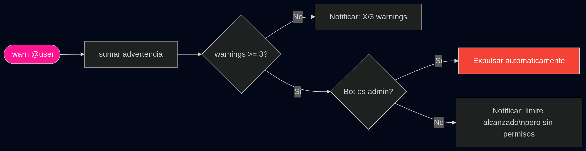

---

### Economia virtual

| Comando                 | Alias                    | Descripcion                              | Cooldown |
| ----------------------- | ------------------------ | ---------------------------------------- | -------- |
| `!balance [@user]`      | `!bal` `!dinero` `!cash` | Ver saldo, rango y estado del daily      | 3 seg    |
| `!daily`                | —                        | Recompensa diaria con streak acumulativo | 24 horas |
| `!weekly`               | `!semanal`               | Recompensa semanal con bonus por racha   | 7 dias   |
| `!work`                 | —                        | Trabajar en un oficio aleatorio          | 1 hora   |
| `!pay @user <cantidad>` | `!transfer`              | Transferir monedas a otro usuario        | 5 seg    |
| `!shop`                 | `!store` `!tienda`       | Ver catalogo completo de la tienda       | 3 seg    |
| `!buy <numero>`         | `!comprar`               | Comprar un item de la tienda             | 5 seg    |

**Catalogo de la tienda:**

| #   | Item                               | Precio  | Tipo      | Duracion   |
| --- | ---------------------------------- | ------- | --------- | ---------- |
| 1   | Rol VIP                            | $5,000  | Rol       | 7 dias     |
| 2   | Rol Leyenda                        | $10,000 | Rol       | 7 dias     |
| 3   | Color de nombre personalizado      | $3,000  | Cosmetico | Permanente |
| 4   | Bypass de cooldown (−50%)          | $2,000  | Mejora    | 24 horas   |
| 5   | Boost de XP (doble)                | $1,500  | Mejora    | 24 horas   |
| 6   | Amuleto de suerte (+10% en juegos) | $2,500  | Mejora    | 24 horas   |

**Progresion del sistema de recompensas:**

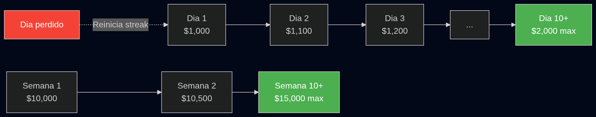

**Oficios disponibles en `!work`:**

| Oficio      | Rango de pago | XP ganado       |
| ----------- | ------------- | --------------- |
| Programador | $500 — $1,500 | 10% del salario |
| Maestro     | $400 — $1,200 | 10% del salario |
| Chef        | $300 — $1,000 | 10% del salario |
| Musico      | $250 — $900   | 10% del salario |
| Conductor   | $200 — $800   | 10% del salario |

---

### Juegos

| Comando                           | Alias                   | Descripcion                  | Apuesta minima | Cooldown |
| --------------------------------- | ----------------------- | ---------------------------- | -------------- | -------- |
| `!slots <apuesta>`                | `!slot` `!tragamonedas` | Maquina tragamonedas         | $10            | 5 seg    |
| `!coinflip <cara/cruz> <apuesta>` | `!cf`                   | Cara o cruz                  | $1             | 5 seg    |
| `!inventory [@user]`              | `!inv` `!inventario`    | Ver inventario RPG con items | —              | —        |

**Tabla de pagos de `!slots`:**

| Combinacion      | Simbolo       | Multiplicador | Nombre    |
| ---------------- | ------------- | ------------- | --------- |
| Triple 7         | 7 7 7         | x10           | JACKPOT   |
| Triple Diamante  | Diamante x3   | x8            | MEGA WIN  |
| Triple Campana   | Campana x3    | x5            | BIG WIN   |
| Triple Estrella  | Estrella x3   | x4            | GREAT WIN |
| Triple Limon     | Limon x3      | x3            | NICE WIN  |
| Triple Cereza    | Cereza x3     | x3            | GOOD WIN  |
| Dos iguales      | Cualquiera x2 | x1.5          | TWO MATCH |
| Sin coincidencia | —             | x0            | NO MATCH  |

---

### Logros desbloqueables

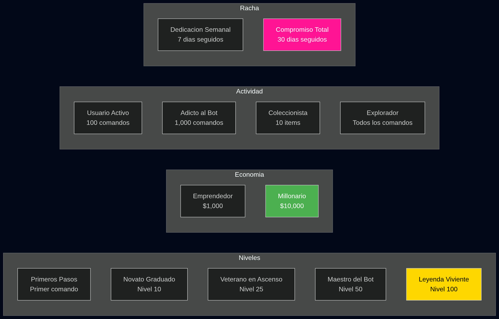

---

### Inteligencia Artificial

| Comando         | Alias                    | Descripcion                                       | Cooldown |
| --------------- | ------------------------ | ------------------------------------------------- | -------- |
| `!ai <mensaje>` | `!chat` `!vania` `!ask`  | Chat con IA — mantiene historial por usuario      | 4 seg    |
| `!aiclear`      | `!aiborrar` `!airestart` | Limpiar tu historial personal de conversacion     | 3 seg    |
| `!aiclear all`  | —                        | Limpiar historial de todos los usuarios del grupo | 3 seg    |
| `!transcribe`   | `!voz` `!voice` `!stt`   | Transcribir nota de voz o archivo de audio        | 10 seg   |

**Flujo del chat con IA:**

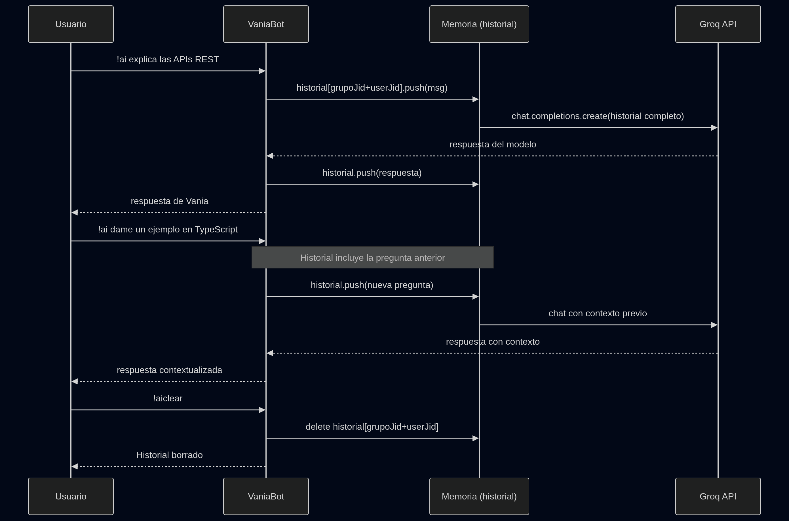

**Flujo de transcripcion de audio:**

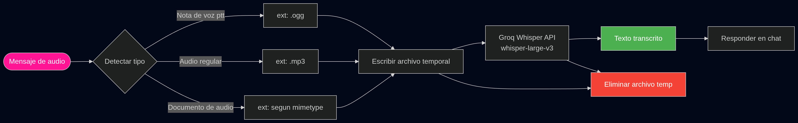

---

### Medios y Stickers

| Comando                   | Alias                  | Descripcion                                    | Cooldown |
| ------------------------- | ---------------------- | ---------------------------------------------- | -------- |
| `!sticker`                | `!s` `!stiker`         | Convertir imagen o video a sticker             | —        |
| `!nota <texto>`           | `!note`                | Sticker de texto sobre plantilla de nota       | 5 seg    |
| `!pat <texto>`            | `!patrick`             | Sticker de meme Patrick con texto superpuesto  | 5 seg    |
| `!qc <texto>`             | `!quote`               | Sticker de cita con foto de perfil del usuario | 5 seg    |
| `!take <pack>\|<autor>`   | `!steal` `!wm`         | Robar sticker y cambiar nombre/autor           | 3 seg    |
| `!ytmp3 <busqueda o URL>` | `!yta` `!ytaudio`      | YouTube a MP3 — busqueda o URL directa         | 30 seg   |
| `!ytmp4 <busqueda o URL>` | `!ytv` `!ytvideo`      | YouTube a MP4 — busqueda o URL directa         | 30 seg   |
| `!tiktok <URL>`           | `!tt` `!tk`            | Video de TikTok sin marca de agua              | 30 seg   |
| `!instagram <URL>`        | `!ig` `!insta` `!reel` | Instagram: Reels, posts e imagenes             | 30 seg   |
| `!facebook <URL>`         | `!fb` `!fbvideo`       | Facebook: videos y Reels publicos              | 30 seg   |

> Para stickers de video se requiere FFmpeg instalado. Videos mayores a 10 segundos pueden ser rechazados por la API de WhatsApp.

---

### Utilidades

| Comando                 | Alias                 | Descripcion                                  | Cooldown |
| ----------------------- | --------------------- | -------------------------------------------- | -------- |
| `!level [@user]`        | `!lvl` `!rank` `!xp`  | Ver nivel, XP y estadisticas de progreso     | 3 seg    |
| `!achievements [@user]` | `!logros` `!trofeos`  | Logros desbloqueados con barra de progreso   | —        |
| `!all [mensaje]`        | `!everyone` `!tagall` | Mencionar a todos los miembros del grupo     | 30 seg   |
| `!calc <expresion>`     | `!math` `!calcular`   | Calculadora avanzada y conversor de unidades | 2 seg    |
| `!acortar <URL>`        | `!short` `!tinyurl`   | Acortar una URL larga con TinyURL            | 5 seg    |
| `!welcome [accion]`     | `!bienvenida`         | Configurar mensaje de bienvenida del grupo   | —        |
| `!goodbye [accion]`     | `!despedida` `!bye`   | Configurar mensaje de despedida del grupo    | —        |

**Acciones de `!welcome` y `!goodbye`:**

```
!welcome on            →  Activar
!welcome off           →  Desactivar
!welcome set <msg>     →  Personalizar mensaje
!welcome test          →  Probar en tiempo real
!welcome reset         →  Restaurar mensaje por defecto
!welcome pic           →  Activar foto de perfil en bienvenida
!welcome nopic         →  Desactivar foto de perfil
```

**Variables en mensajes de bienvenida y despedida:**

| Variable | Reemplaza con                       |
| -------- | ----------------------------------- |
| `@user`  | Nombre del usuario que entra o sale |
| `@group` | Nombre del grupo                    |
| `@desc`  | Descripcion del grupo               |
| `@count` | Numero total de miembros            |
| `@fact`  | Dato curioso aleatorio              |

**Calculadora — operaciones y conversiones soportadas (`!calc`):**

```
Matematicas
  !calc 15% de 340               →  Porcentajes
  !calc (25 * 4) + 100 / 2       →  Expresiones con parentesis
  !calc 5 ^ 2                    →  Potencias

Conversiones
  !calc 5 km a m                 →  Longitud
  !calc 100 kg a lb              →  Peso / masa
  !calc 37 C a F                 →  Temperatura (C, F, K)
  !calc 1 gb a mb                →  Digital (b, kb, mb, gb, tb, pb)
  !calc 3.6 km/h a m/s           →  Velocidad
  !calc 500 ml a cup             →  Volumen
  !calc 10000 m2 a ha            →  Area
```

---

### Comandos exclusivos del Owner

| Comando                     | Alias                  | Descripcion                                    |
| --------------------------- | ---------------------- | ---------------------------------------------- |
| `!autoadmin`                | `!sadmin` `!makeadmin` | Autopromocion a administrador del grupo actual |
| `!grant money @user <cant>` | `!give` `!dar`         | Conceder dinero a un usuario                   |
| `!grant xp @user <cant>`    | —                      | Conceder XP a un usuario                       |
| `!grant item @user <item>`  | —                      | Agregar un item al inventario de un usuario    |
| `!setowner add @user`       | `!makeowner`           | Otorgar permisos de propietario del bot        |
| `!setowner remove @user`    | `!removeowner`         | Revocar permisos de propietario                |

> Al agregar a alguien como owner, sus estadisticas se elevan al maximo automaticamente. Al removerlo, se reinician a valores por defecto.

---

## Sistema de permisos

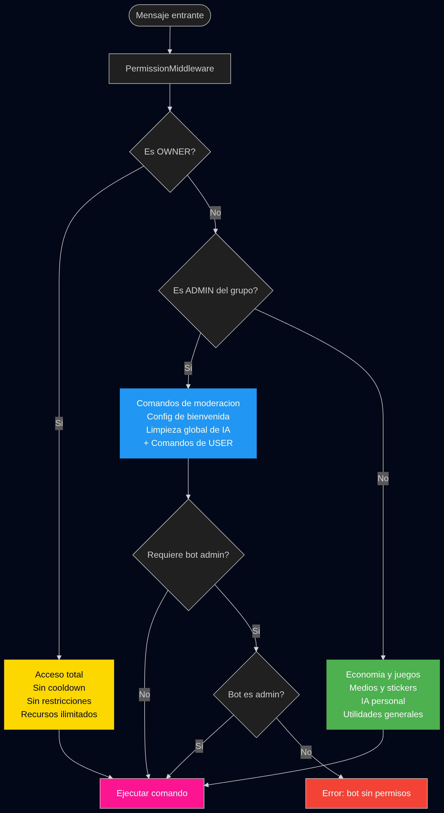

**Resumen de niveles:**

| Nivel     | Acceso                       | Inmunidad                      | Recursos   |
| --------- | ---------------------------- | ------------------------------ | ---------- |
| **OWNER** | Total — todos los comandos   | No se puede bannear ni warnear | Ilimitados |
| **ADMIN** | Moderacion + usuario         | Ninguna especial               | Normales   |
| **USER**  | Economia, juegos, medios, IA | Ninguna                        | Normales   |

---

## Motor de economia

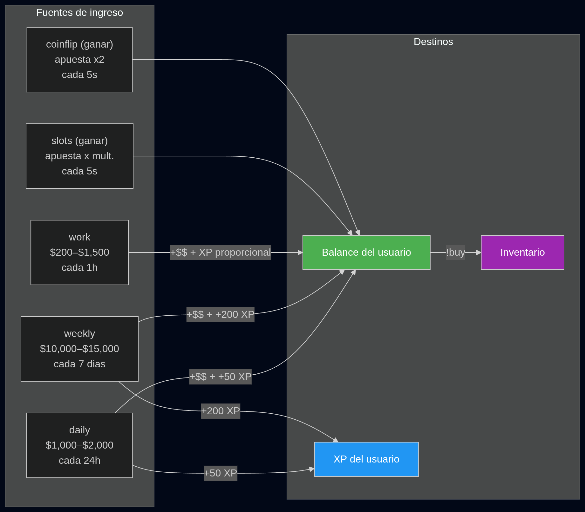

---

## Sistema de reinicio automatico

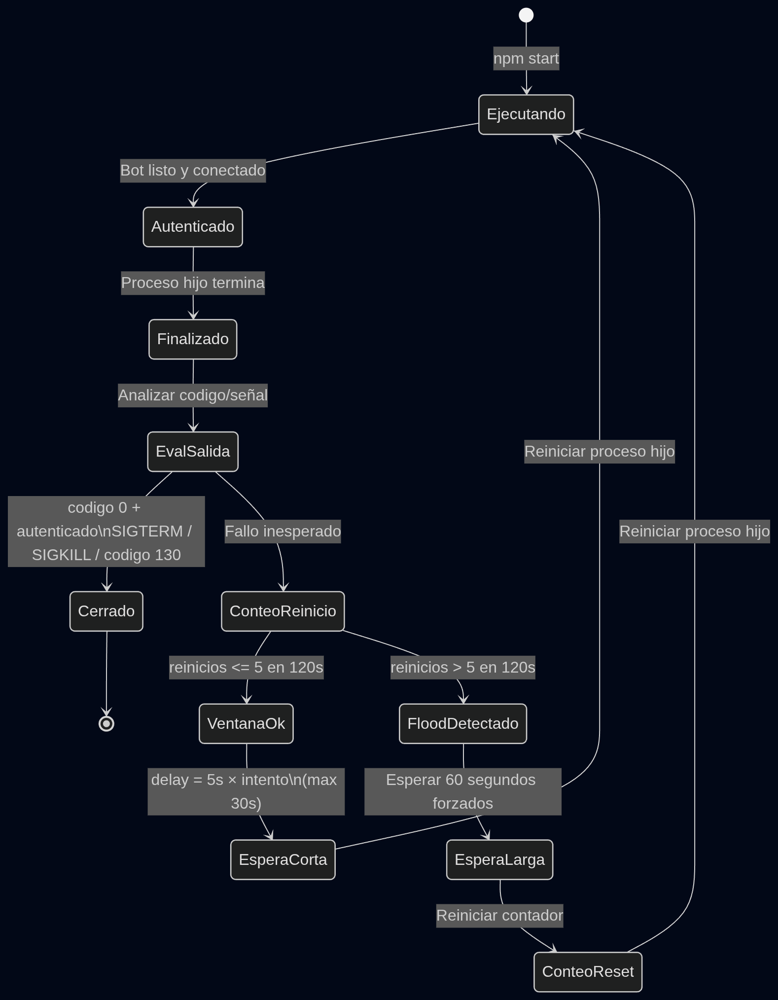

---

## Pipeline de middleware

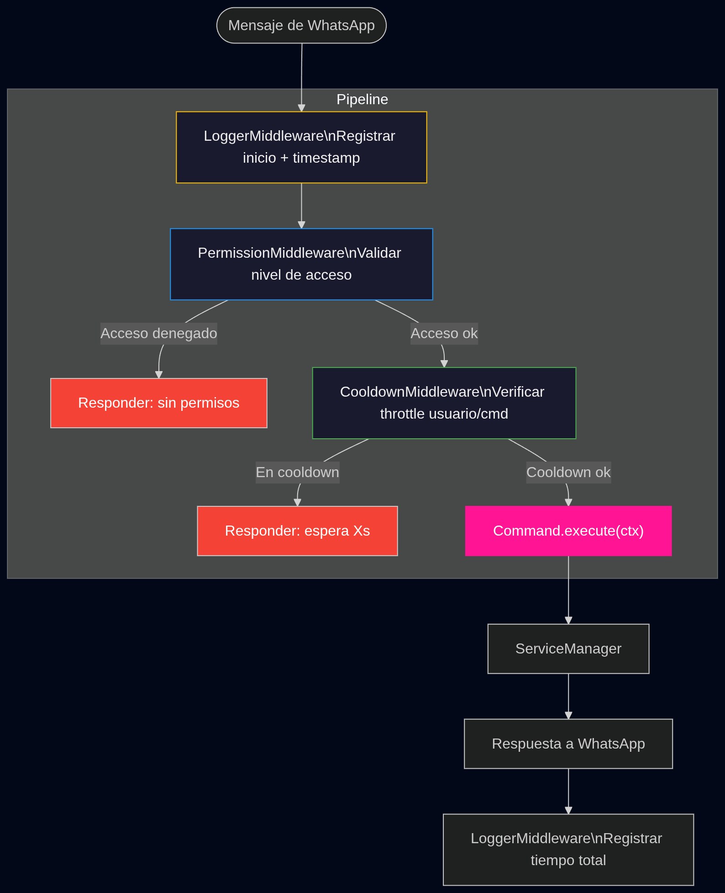

---

## Stack tecnologico

<table>
<tr>
<th>Capa</th>
<th>Tecnologia</th>
<th>Version</th>
<th>Uso</th>
</tr>
<tr>
<td><strong>Lenguaje</strong></td>
<td>TypeScript</td>
<td>ES2022, strict</td>
<td>Lenguaje principal con tipos fuertes en todo el codebase</td>
</tr>
<tr>
<td><strong>Runtime</strong></td>
<td>Node.js + tsx</td>
<td>18+</td>
<td>Ejecucion directa de TS sin compilar</td>
</tr>
<tr>
<td><strong>WhatsApp</strong></td>
<td>Baileys</td>
<td>@whiskeysockets</td>
<td>Cliente de WhatsApp Web API sin app oficial</td>
</tr>
<tr>
<td><strong>IA</strong></td>
<td>Groq SDK</td>
<td>LLaMA + Whisper</td>
<td>Chat generativo y transcripcion de audio</td>
</tr>
<tr>
<td><strong>Imagenes</strong></td>
<td>sharp</td>
<td>Latest</td>
<td>Composicion de stickers, overlay SVG, resize</td>
</tr>
<tr>
<td><strong>Video/Audio</strong></td>
<td>FFmpeg</td>
<td>Cualquiera estable</td>
<td>Conversion para stickers animados y descargas</td>
</tr>
<tr>
<td><strong>HTTP</strong></td>
<td>axios</td>
<td>Latest</td>
<td>Stickers de cita (bot.lyo.su) y downloaders</td>
</tr>
<tr>
<td><strong>CLI</strong></td>
<td>chalk</td>
<td>Latest</td>
<td>Colores y estilos en consola del proceso padre</td>
</tr>
<tr>
<td><strong>URLs</strong></td>
<td>TinyURL API</td>
<td>REST</td>
<td>Acortamiento de URLs en !acortar</td>
</tr>
</table>

**Aliases de rutas (`tsconfig.json`):**

```jsonc
{
  "compilerOptions": {
    "target": "ES2022",
    "module": "ESNext",
    "moduleResolution": "bundler",
    "strict": true,
    "experimentalDecorators": true,
    "emitDecoratorMetadata": true,
    "declaration": true,
    "sourceMap": true,
    "paths": {
      "@/*": ["src/*"],
      "@config/*": ["src/config/*"],
      "@core/*": ["src/core/*"],
      "@commands/*": ["src/commands/*"],
      "@services/*": ["src/services/*"],
      "@utils/*": ["src/utils/*"],
      "@types/*": ["src/types/*"],
    },
  },
}
```

---

## Guia de desarrollo

### Agregar un nuevo comando

**1.** Crear el archivo en la carpeta del dominio correspondiente:

```typescript
// src/commands/utility/MiComando.ts
import { Command } from "../Command.js";
import {
  CommandCategory,
  CommandContext,
  PermissionLevel,
  type MessageContext,
} from "@/types/index.js";

export class MiComando extends Command {
  name = "micomando";
  description = "Descripcion clara del comando";
  category = CommandCategory.UTILITY;
  aliases = ["mc", "micmd"];
  usage = "!micomando <argumento> [opcional]";
  examples = ["!micomando hola", "!micomando mundo"];
  cooldown = 3000; // milisegundos
  contexts = [CommandContext.BOTH]; // GROUP | PRIVATE | BOTH
  permissions = { user: [PermissionLevel.USER] };

  async execute(ctx: MessageContext): Promise<void> {
    if (!ctx.args.length) {
      await ctx.reply(`Uso: ${this.usage}`);
      return;
    }

    await ctx.react("⏳");

    const resultado = ctx.args.join(" ").toUpperCase();
    await ctx.reply(`Resultado: ${resultado}`);

    await ctx.react("✅");
  }
}
```

**2.** Registrar el comando en el `CommandRegistry` o loader automatico del proyecto.

---

### Propiedades disponibles en `MessageContext`

```typescript
// Informacion del remitente
ctx.sender.jid; // JID del usuario: 521XXXXXXXXXX@s.whatsapp.net
ctx.sender.pushName; // Nombre visible en WhatsApp
ctx.sender.isAdmin; // true si es admin del grupo
ctx.sender.isOwner; // true si es owner del bot

// Informacion del chat
ctx.chat.jid; // JID del grupo o chat privado
ctx.chat.isBotAdmin; // true si el bot es admin en este grupo

// Contenido del mensaje
ctx.args; // string[] — argumentos del comando
ctx.command; // string — nombre del comando sin prefijo
ctx.quoted; // WAMessage | null — mensaje citado
ctx.message; // WAMessage — mensaje completo de WhatsApp

// Acciones
ctx.reply(texto); // Responder al mensaje actual
ctx.react(emoji); // Reaccionar con emoji al mensaje
ctx.sock; // Socket de Baileys — acceso total a la API
```

---

### Utilidades disponibles

```typescript
// validators.ts
import {
  isValidWhatsAppNumber,
  isGroupJid,
  isUserJid,
  isValidUrl,
} from "@/utils/validators.js";

isValidWhatsAppNumber("+521XXXXXXXXXX"); // true
isGroupJid("123456789@g.us"); // true
isUserJid("521XXXXXXXXXX@s.whatsapp.net"); // true
isValidUrl("https://example.com"); // true

// helpers.ts
import { formatNumber, formatTime } from "@/utils/helpers.js";

formatNumber(1500000); // "1,500,000"
formatTime(3661000); // "1h 1m 1s"
```

---

### Archivos que no deben versionarse

```gitignore
# Sesion de WhatsApp
vaniasession/
.vania-session

# Entorno
.env

# Dependencias y compilacion
node_modules/
dist/

# Archivos temporales de audio/video
data/temp/
```

---

## Aviso legal

<div align="center">

```
━━━━━━━━━━━━━━━━━━━━━━━━━━━━━━━━━━━━━━━━━━━━━━━━━━━━━━━━━━━━
   El uso de clientes no oficiales de WhatsApp puede violar
   los Terminos de Servicio de WhatsApp / Meta.
   Este proyecto es de caracter educativo y experimental.
   Utilizalo bajo tu propia responsabilidad.
━━━━━━━━━━━━━━━━━━━━━━━━━━━━━━━━━━━━━━━━━━━━━━━━━━━━━━━━━━━━
```

<br/>

**VaniaBot IA** — Construido con TypeScript y Baileys


</div>
